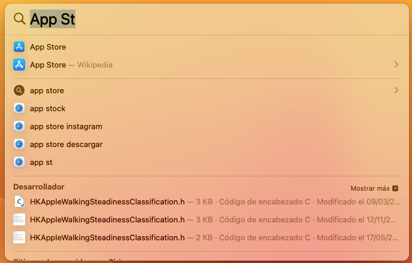
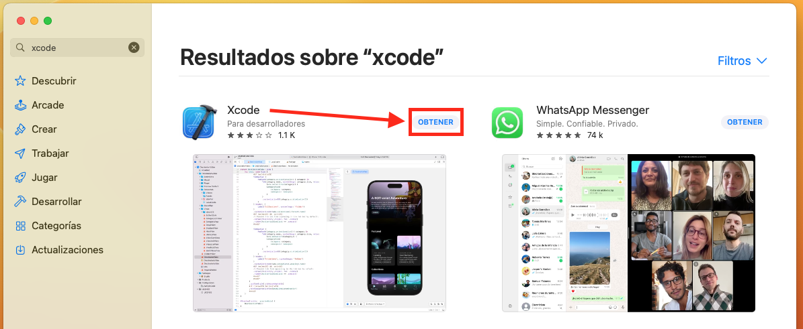
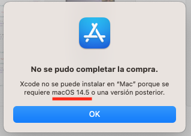
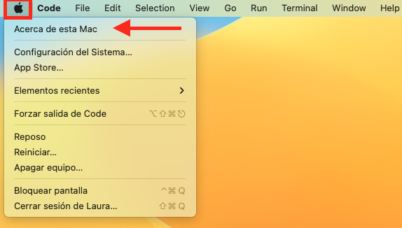
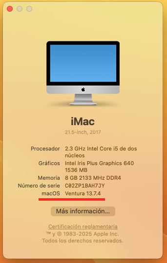
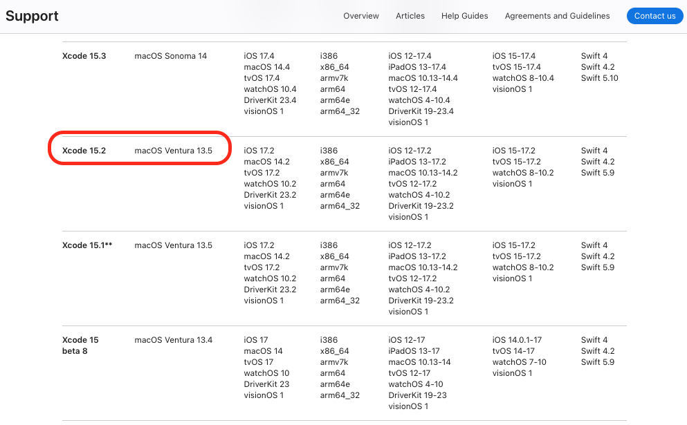
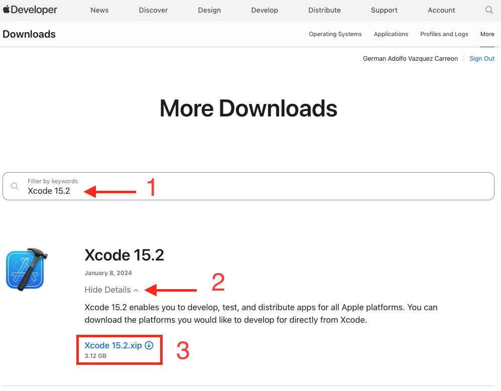
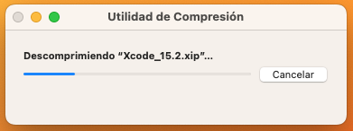
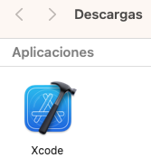
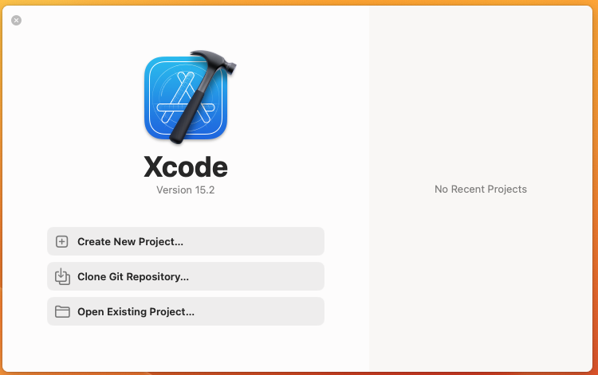

# Selenium 4 Beginners

- [Selenium 4 Beginners](#selenium-4-beginners)
  - [Pasos de Instalación preliminares](#pasos-de-instalación-preliminares)
    - [Lo que no te cuentan en los cursos en línea](#lo-que-no-te-cuentan-en-los-cursos-en-línea)
    - [Happy Path - Desde App Store (Pay to Win)](#happy-path---desde-app-store-pay-to-win)
    - [Buscar versiones compatibles](#buscar-versiones-compatibles)
    - [El administrador de librerías de MAC](#el-administrador-de-librerías-de-mac)
    - [El mejor sistema de control de versiones](#el-mejor-sistema-de-control-de-versiones)
    - [Se comienza con el ' .gitignore '](#se-comienza-con-el--gitignore-)

## Pasos de Instalación preliminares

<details>

<summary>Configuración de IDE y Java en MAC</summary>

<details>

<summary>Instalar XCode desde la terminal, para instalar Homebrew</summary>

### Lo que no te cuentan en los cursos en línea

- La mayoría de Cursos en línea (como es de esperarse) son hechos por profesionales con
mucha experiencia y generalmente con una vida laboral activa.
- Son expertos en su tema, pero, ¿Qué tan buenos son enseñando ese tema?
- Después de tomar muchos de éstos cursos ha observado un patrón; todos tienen un sistema pre-configurado y en su mejor esfuerzo por transmitir sus conocimientos y habilidades, aún en los tutoriales 'De Cero a Experto' o 'From Zero to Hero' omiten pasos por que inadvertidamente, YA los hicieron.

 Justo este PASO y específicamente en MAC, nunca he visto que nadie lo considere, y me refiero al siguiente Path:

 1. Instalar `XCode`
 2. Instalar `Homebrew`
 3. Usar HomeBrew para instalar todo lo demás.

Si intentas seguir cualquier curso, te llevarás la sorpresa de que requieres una paquetería propia de Apple, llamada XCode.

### Happy Path - Desde App Store (Pay to Win)

Idealmente, tienes una MAC con un Sistema Operativo actualizado, y sólo debes entrar a la App Store haciendo:

> CMD + SPACE
>
y escribiendo `App Store` :



 Una vez dentro teclear `XCode`.

Idealmente, sólo con dar click en `Obtener` e `Instalar` podrás descargarlo:



Pero, la realidad es que, probablemente tu SO no esté actualizado y recibas un mensaje de error:



Para estos casos, sigue leyendo...

### Buscar versiones compatibles



Encontramos la versión de nuestra computadora:



Vamos a buscar la versión de `XCode` compatible, entrando en:

[https://developer.apple.com/support/xcode](https://developer.apple.com/support/xcode)

y buscamos en la segunda columna nuestro iOS para encontrar la máxima versión compatible:



Ahora, debemos ir a otra página para buscar la versión `Xcode 15.2` , en este caso.

Nos dirijimos a, donde deberemos crear una cuenta (es GRATIS) para poder acceder:

(https://developer.apple.com/download/all/)[https://developer.apple.com/download/all/]

En la barra de búsqueda, escribimos `Xcode 15.2` (o lo que aplique) y descargamos el archivo con extensión `*.XIP` :



Dar roble click:



Luego de 5 minutos, en la misma carpeta de descargas aparecerá la aplicación:



Y deberemos dar doble click para instalarla.

Después de Aceptar , ingresar la contraseña y todo, deberías ver esta ventana:



</details>

<details>

<summary>Instalar Home Brew, para instalar Git</summary>

### El administrador de librerías de MAC

- Se puede instalar desde Terminal visitando la [Página Oficial](https://brew.sh/)


De la misma manera, ingresamos el comando directo en la Terminal:


Pregunta, por seguridad, si fuimos nosotros quienes hicimos eso...


Después de ingresar la contraseña del equipo, vuelve a preguntar:


</details>

<details>

<summary>Por fin, instalar Git usando HomeBrew</summary>

### El mejor sistema de control de versiones

- Se puede instalar desde Terminal visitando la [Página Oficial Git](https://git-scm.com/downloads/mac)


Se escribe el comando en la terminal.


</details>

</details>

<details>

<summary>Inicializando el Repositorio del proyecto, correctamente</summary>

### Se comienza con el ' .gitignore '

- Creamos un archivo de texto plano, con nombre  `.gitignore` y el siguiente contenido:

``` t
# Carpeta con imágenes del PDF generado
images/

# Archivo especìfico a ignorar, sólo queremos el PDF.
Selenium_4_Beginners.md
```

- Creamos un archivo llamado `README.md`

En línea, seguimos los siguientes pasos:

- Enter <https://github.com/>
- Sign up
- Click on '+', and click 'New Repositoty'
- Type-a-name for the New Repo Online
- Do NOT select checkbox 'Add a README file'
- Do NOT select '.gitignore' template
- Do NOT select any License
- Click on 'Create repository'
- Copy URL from online repo

GUARDAMOS, y una vez hecho esto abrimos GIT desde la terminal para inicializar nuestro proyecto:

- git init
- git status
- git add .
- git status
- git commit -m "Primer Commit"
- git branch -M main
- git remote add origin <https://github.com/mx-gvazquez/Selenium_4_beginners.git>
- git push -u origin main

</details>
